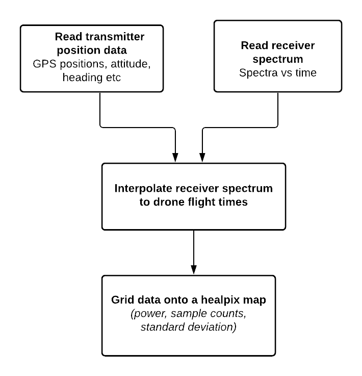

.. ECHO documentation master file, created by
   sphinx-quickstart on Mon Jul 13 10:42:31 2020.
   You can adapt this file completely to your liking, but it should at least
   contain the root `toctree` directive.

Welcome to ECHO's documentation!
================================
ECHO is a system for calibrating wide-field radio arrays targeting highly redshifted 21cm radiation from the early universe using a radio transmitter mounted on a drone.
For more details you can read the first demonstration of ECHO paper by Jacobs et al. 2017 here_

This repository contains software used to generate flight plans, collect and reduce resulting data from a calibration run. 

.. _here: https://ui.adsabs.harvard.edu/abs/2017PASP..129c5002J/abstract

Workflow
----------

ECHO setup 
------------

.. image:: ../images/ECHO_setup.png
    :width: 700px
    :align: center
    :height: 400px
    :alt: LWA-SV '19 setup

Flight Path
-----------------

ECHO follows a spherical shell flight pattern centered around the antenna under test as shown in the figure. 

.. image:: ../images/flightpath.png
    :width: 300px
    :align: center
    :height: 200px
    :alt: flight path

.. toctree::
   :caption: Contents:
   
   
   Installation <installation>
   Tutorial <tutorial>
   API Reference <api>

Indices and tables
==================

* :ref:`genindex`
* :ref:`modindex`
* :ref:`search`
