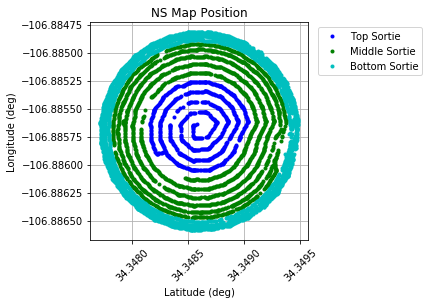

.. ECHO documentation master file, created by
   sphinx-quickstart on Mon Jul 13 10:42:31 2020.
   You can adapt this file completely to your liking, but it should at least
   contain the root `toctree` directive.

.. highlight:: python

Tutorial
================================
The ECHO repository is used to analyze data from a calibration run. Files generated in a typical calibration run are:
 1. Two types of drone log files- tlogs(Qgroundcontrol logs) and ulogs (PX4 logs)
 2. Response of antenna under test(AUT) (hdf5 file format, usually spectra vs time)
 3. Simulated transmitter beam  (CST export text)
 4. Electromagnetic models of antenna under test (numpy NPZ file)

To begin with, we make an Observation Object, passing in latitude and longitude of AUT, transmitter frequency and short description of the AUT ::

    import ECHO

    NS_Obs = ECHO.Observation(lat=34.3486, lon=-106.8857, frequency=70, description='LWA Observation')

Working with sorties
--------------------

The hemispherical flight path is split into smaller chunks aka 'sorties' owing to the battery life of the drone.

    2D plot of a hemispherical flight pattern.

Each sortie is associated with two types of drone logs and an antenna spectra file. ::

    datadir = '/LWA_October_2019/data/'

    NS_Obs.addSortie(
        tlog=datadir+"tlog_data/NSMap_MiddleSortie.txt",
        ulog=datadir+"ulog_data/NSMap_MiddleSortie.ulg",
        data=datadir+"LWA_spectra/NS_Sorties/01_NSmap_MidSortie_waterfall.hdf5",
        sortie_title="NS Mid"
        )

    NS_Obs.read_sorties()

The data is placed in dicts within the object. ::

    print(NS_Obs.sortie_list[0].t_dict.keys())
    print(NS_Obs.sortie_list[0].u_dict.keys())

Additional sorties can be added to a single observation::

    #add two additional sorties
    NS_Obs.addSortie(
        tlog=datadir+"tlog_data/NSMap_TopSortie_Repeat.txt",
        ulog=datadir+"ulog_data/NSMap_TopSortie_Repeat.ulg",
        data=datadir+"LWA_spectra/NS_Sorties/03_NSmap_TopSortie_waterfall.hdf5"
        )

    NS_Obs.addSortie(
        tlog=datadir+"tlog_data/NSMap_BottomSortie.txt",
        ulog=datadir+"ulog_data/NSMap_BottomSortie.ulg",
        data=datadir+"LWA_spectra/NS_Sorties/02_NSmap_BotSortie_waterfall.hdf5"
        )

    #read in all of the current sorties, apply bootstart correction, and flag the start/endpoints
    for sortie in NS_Obs.sortie_list:
        sortie.read() #Note that this replaces all previous reads
        sortie.apply_bootstart()
        sortie.flag_endpoints()

    #takes the data from all sorties, sorts them by time, and combines them into a single array
    NS_Obs.combine_sorties()

    #combine the drone position data with the intrument response
    NS_Obs.interpolate_rx(1,1,'XX')

Visualizing Data
-------------------

Now, we create a Beam object to visualise the antenna response ::

    NS_Obs.make_beam()

Once the beam object is created, the healpix map can be visualised by executing ::

    NS_Obs.plot_beam()

E and H planes of the beammap can be plotted by executing ::

    NS_Obs.plot_slices(figsize=(10,10))

Working with CST beams
-------------------------

ECHO uses pyuvbeam to read-in CST export files of the transmitter beam.
To do so instantiate a Beam object with beam_type = 'efield' or 'power' and call the read_cst_beam()::

    tx_beam = ECHO.Beam(beam_type= 'efield')
    CST_file = '../Chiropter_NS_PECBico_ff70_ZupYnull.txt'
    tx_beam.read_cst_beam(CST_file, beam_type='efield', frequency=[70e6],
                   telescope_name='Chiropter', feed_name='BicoLOG', feed_version='1.0',
                   model_name = 'Chiropter_NS_2019', model_version='1.0', feed_pol='y')

To plot the cst beam: ::

    tx_beam.plot_efield()
